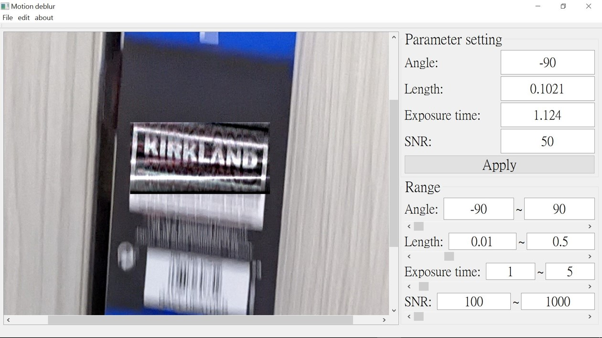

# Restoration of motion blur images

    
   
    

# User interface
Here we have a user interface to perform motion deblur by the following steps:

**Step 1.** Load image
 
To click on "file->Open" to load    images (.jpg/.bmp/.png/.tif)

    
   
    

# User interface ROI and Motion direction

    
   
    

**Step 2** 
 
To click on "file->Open" to load      images (.jpg/.bmp/.png/.tif)
# Parameter adjustment and Result

    
   
    

# Image acquisition of static object

    
   
    

# Image acquisition of motion object

    
   
    

    
   
    

    
   
    

    
   
    

    
   
    

    
   
    

    
   
    

    
   
    

    
   
    

# User interface
## User interface
### User interface
#### User interface
##### User interface
###### User interface
####### User interface

# **User interface**
## **User interface**
### **User interface**
#### **User interface**
##### **User interface**
###### **User interface**
####### User interface

**User interface**

| Before      |After        |
:-------------------------:|:-------------------------:
 | 

  
