# Restoration of motion blur images

    
   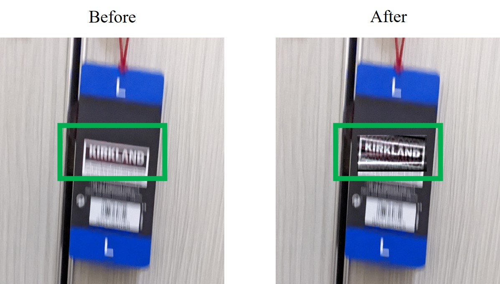
    

# User interface
Here we have a user interface to perform motion deblur by the following steps:

**Step 1.** Load image
 
To click on "file->Open" to load image (.jpg/.bmp/.png/.tif)

    
   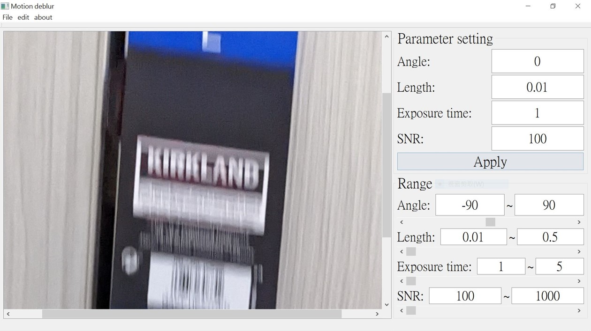
    

**Step 2.** Specify motion direction and region of interest
 
In this stage, we need to specify both the direction of motion and the region of interest to be proecssed  
(1) To click on "Edit->Parameter setting->from graph", and draw a line representing motion direction from graph  
(2) To click on "Edit->ROI", and select region of interest from graph (This action was to facilitate processing speed)  

    
   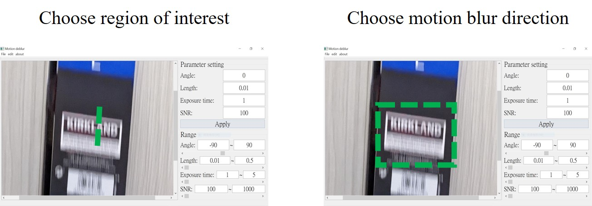
    

**Step 3.** Parameter adjustment and Result
In the previous we've finished specifying motion direction, and this step is for fine adjustment of motion direction and the parameters affecting the restoration process, for readers interested in details of algorithm please go through the next chapter.

    
   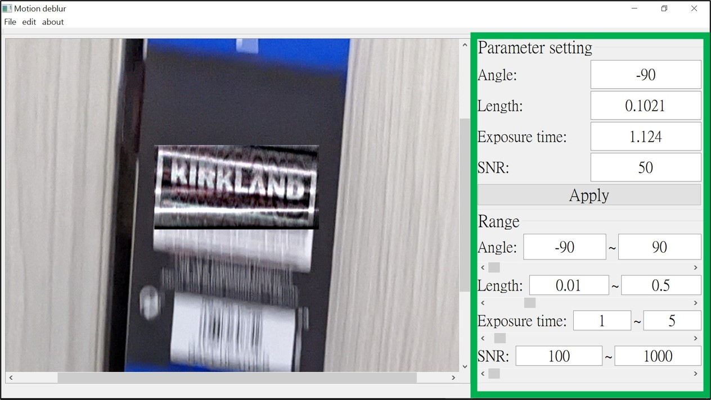
    

# Image acquisition of static object

    
   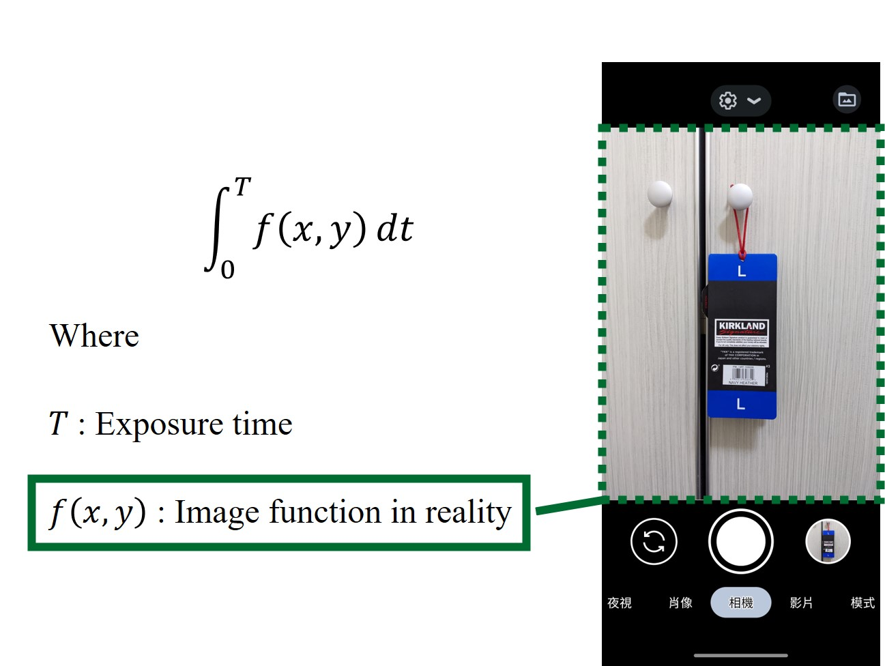
    

# Image acquisition of motion object

    
   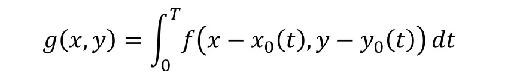
    

    
   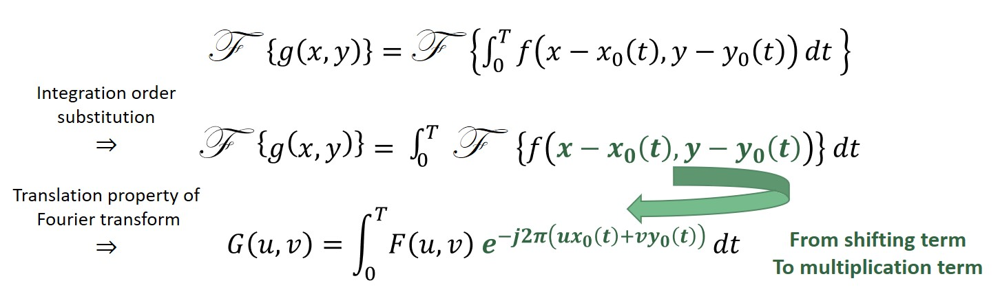
    

    
   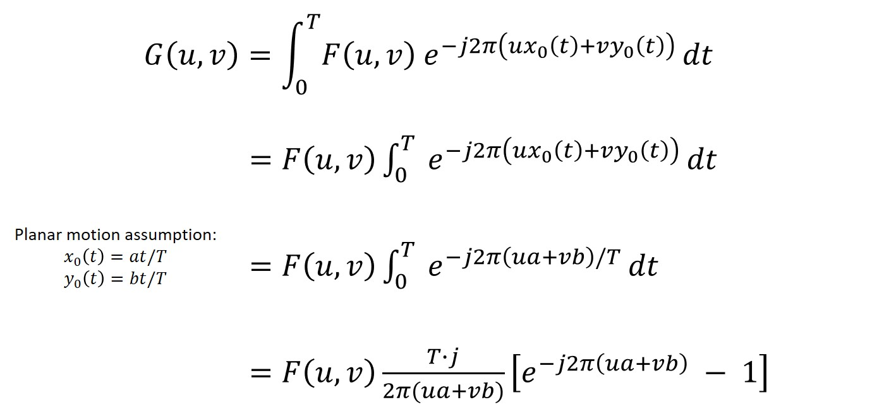
    

    
   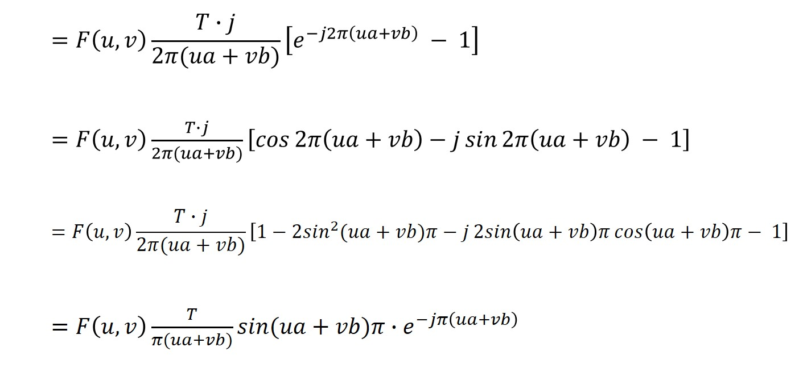
    

    
   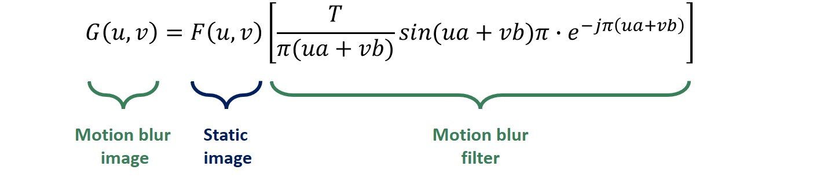
    

    
   
    

    
   
    

    
   
    

    
   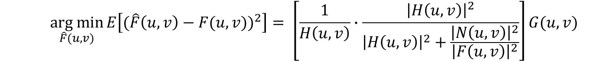
    

# User interface
## User interface
### User interface
#### User interface
##### User interface
###### User interface
####### User interface

# **User interface**
## **User interface**
### **User interface**
#### **User interface**
##### **User interface**
###### **User interface**
####### User interface

**User interface**

| Before      |After        |
:-------------------------:|:-------------------------:
 | 

  
