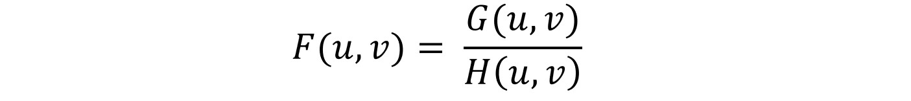

# Restoration of motion blur images
This project is inspired by Chapter 5 in "Digital Image Processing 3th edition", the first time I finish reading this chapter I feel like motion deblur is an amazing technich that I should definitely implement it, and is actually the case since I found this help a lot for the need to identify license plate of a fast moving car, since the restoration process is completely explainable this would also help in political usages.

    
   
    

# User interface
Here we have a user interface to perform motion deblur by the following steps:

**Step 1.** Load image  
To click on "File->Open" to load image (.jpg/.bmp/.png/.tif)

    
   
    

**Step 2.** Specify motion direction and region of interest  
In this stage, we need to specify both the direction of motion and the region of interest to be proecssed  
(1) To click on "Edit->Parameter setting->from graph", and draw a line representing motion direction from graph  
(2) To click on "Edit->ROI", and select region of interest from graph (This action was to facilitate processing speed)  

    
   
    

**Step 3.** Parameter adjustment and Result  
In the previous we've finished specifying motion direction, and this step is for fine adjustment of motion direction and the parameters affecting the restoration process, for readers interested in details of algorithm please go through the next chapter.

    
   
    

# Implementation
To illustrate the concept of motion deblur, we will go through how the image is generated for static and motion objects.  
 
**Image acquisition of static object**  
Let's imagine we have a cell phone ready to take a photo shown in the right side of the graph, and both the scene and the phone are static which means for each pixels of the camera sensor would constantly look at the same spot of the scene during the entire exposure process, and the formulation for the imaging process is:

    
   
    

**Image acquisition of motion object**  
In this case, let's suppose either the scene or the phone are going planar motion during the imaging process, each pixels of the camera would integrate through the scene along the trajectory of motion during the exposure process illustrated in the following figure: 

    
   
    

**Fourier transform**  
Now things going intriguing if we transform the formula of motion imaging into frequency domain, the shifting term in side the expression has become multiplication term outside the function:

    
   
    

    
   
    

And here let's finish the integration and using euler's formula to simply the expression:

    
   
    

    
   
    

We find that in frequency domain, the motion blur image is actually composition of the mulitplication of static image and a filter representing motion blur:

    
   
    

Here let's specify a notation to the term of motion blur for notational simplicity, in a ideal situation the static image could be recovered by the division of motion blur image to the motion blur filter:

    
   
    

    
   
    

In practice we need to account for the additive noise during the imaging process, and wiener filter is designed for the situation that seeks to find minimum mean squared error between the restoration image and the actual image:

    
   
    

    
   
    

